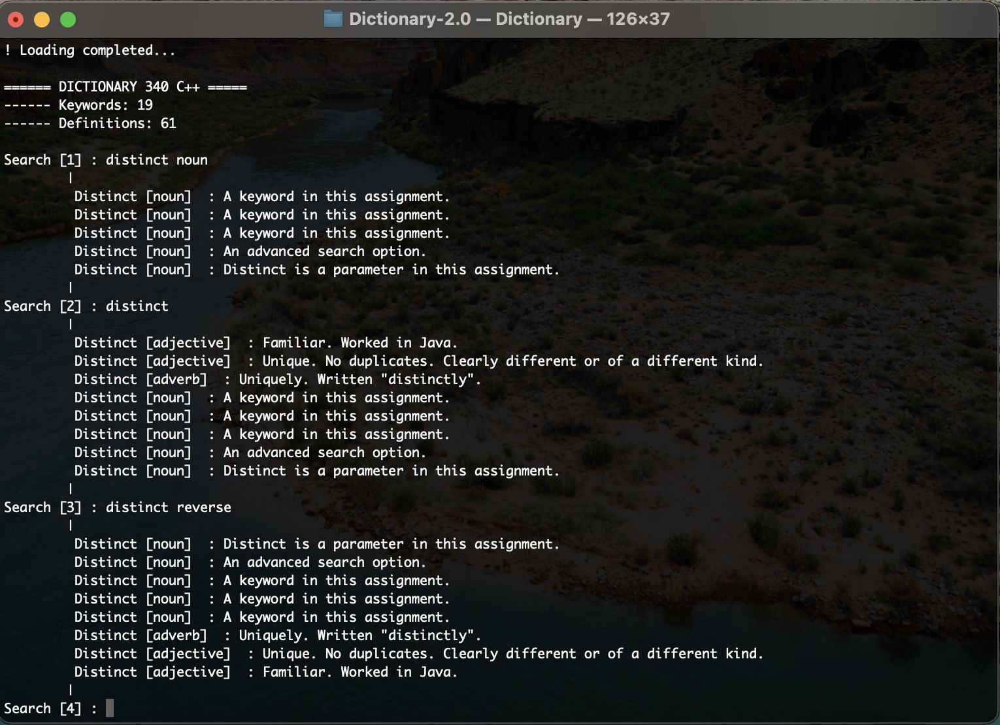

# Dictionary 2.0

## Group Project, C++ Programming, SFSU, Fall 2022

Dictionary 2.0 is a C++ application that reads words and their details from a file and provides various functionalities to process and display this information. The application supports basic operations such as printing words, looking up definitions, and processing word-related data.

## Features

- Read words and their details from a text file.
- Print words and their associated details.
- Process and display specific word-related data based on user input.

## Requirements

- C++11 or later
- A C++ compiler like `g++` or `clang++`

## Installation

1. Clone the repository:

   ```sh
   git clone https://github.com/umidmurad/Dictionary-2.0.git
   cd Dictionary-2.0
   ```

2. Compile the code using `g++` or `clang++`:
   ```sh
   g++ -o Dictionary main.cpp
   ```
   Or with `clang++`:
   ```sh
   clang++ -o Dictionary main.cpp
   ```

## Usage

1. Ensure `Data.CS.SFSU.txt` is in the same directory as the executable. This file should contain the words and their details that the application will process.

2. Run the application:

   ```sh
   ./Dictionary
   ```

3. Follow the prompts to interact with the application. You can perform operations like looking up words, printing details, etc.

## File Structure

- `main.cpp`: Contains the main function and overall program logic.
- `Printer.cpp`: Implements functions for printing words and their details.
- `Printer.h`: Header file for `Printer.cpp`, declaring the functions used.
- `words.txt`: Text file containing the words and their details to be processed by the application.

When you run the application, it reads this file and processes the words accordingly.

## Screenshot

Use Case Shown below


## License

This project is licensed under the MIT License. See the `LICENSE` file for details.
